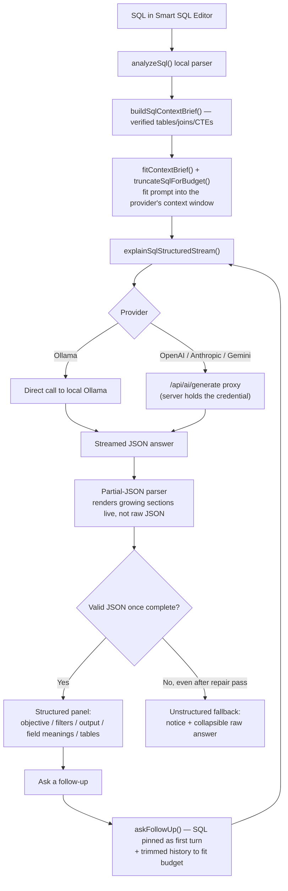
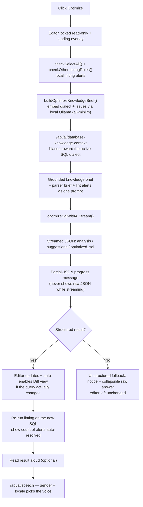
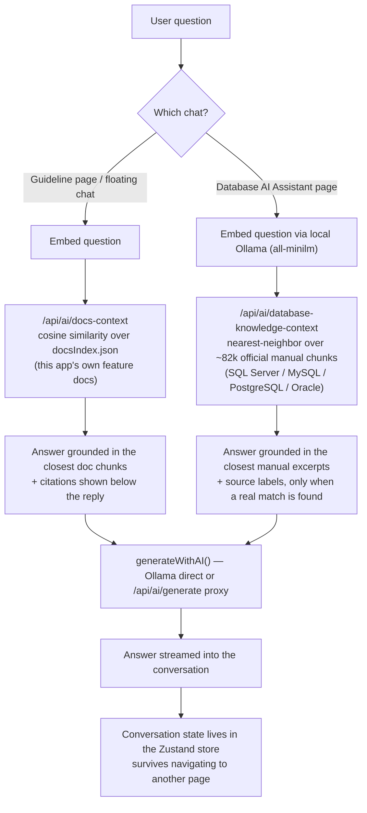
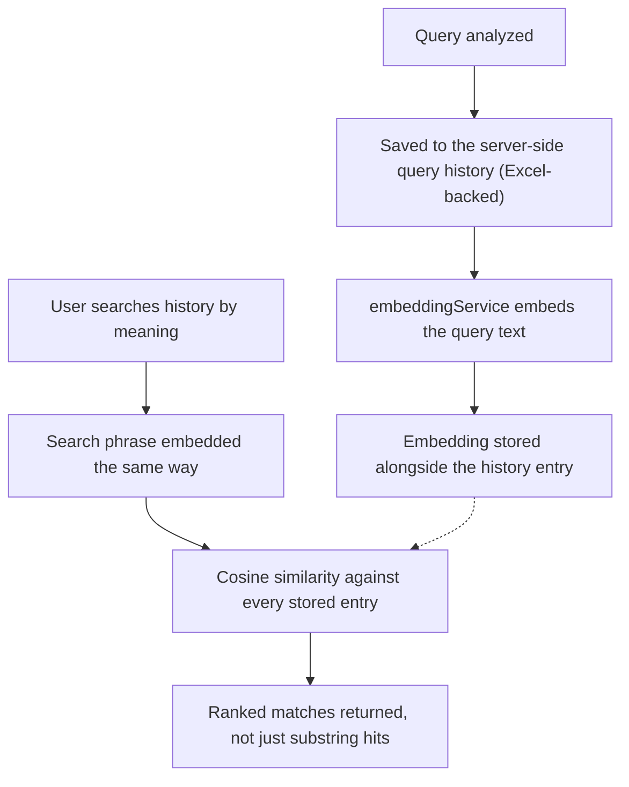
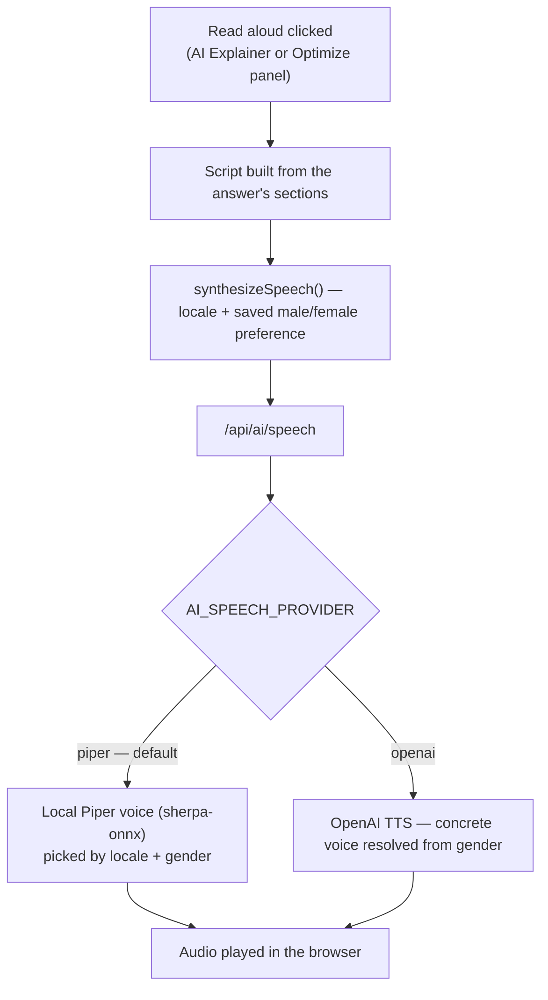

# SQL Visualizer

A comprehensive SQL analysis and visualization tool built with Next.js 15, React 19, and TypeScript. Analyze query complexity, visualize table relationships, explore CTEs, and deep-dive into JOIN conditions across multiple SQL dialects.

## 🚀 Features

### Core Analysis Tools

- **Query Input** - Paste SQL or import MyBatis XML with multi-dialect support (MySQL, PostgreSQL, SQL Server, Oracle)
- **Relationship Graph Visualizer** - Interactive visualization of table relationships and JOIN connections with color-coded edges and multiple layout options
- **JOIN Analysis** - Deep-dive analysis of JOIN conditions with complexity breakdown, column/operator detection, and multi-dialect support
- **Metrics Dashboard** - Real-time complexity scoring (0-100) with detailed breakdowns of keywords, SELECT fields, JOINs, CTEs, subqueries, and window functions. Every metric card and subquery entry shows the source line number and can jump straight to that line in the Smart SQL Editor
- **CTE Analysis** - Explore Common Table Expressions and field origins with visual tree structure, including per-CTE nested subquery detection with accurate nesting depth
- **Smart SQL Editor** - Multi-dialect Monaco-based query editor with formatting, original-vs-edited diff view, and real-time analysis

### AI-Powered Features

- **AI SQL Explainer** - Turns a query into a structured, plain-language explanation (objective, filters, output, referenced tables)
- **AI Optimize** - Streams optimization suggestions and a rewritten query, grounded in the local parser's verified facts (tables, joins, CTE graph)
- **Docs Consultant Chat** - RAG-style chat over the app's own feature docs (embeds the question, retrieves the closest doc chunks, answers with citations)
- **Database AI Assistant** - General database chat for SQL, schema design, indexes, transactions, and performance. When its local RAG index is available, answers are grounded in relevant excerpts from official SQL Server, MySQL, PostgreSQL, and Oracle manuals, with source labels shown below the answer
- **Query History with Semantic Search** - Every analyzed query is saved (server-side Excel-backed store) and searchable by meaning, not just substring, via embeddings
- **Multi-Provider Support** - Local Ollama (no API key needed) or cloud providers (OpenAI, Anthropic, Gemini) proxied through the app server so credentials never reach the browser
- **Text-to-Speech** - Reads AI explanations/optimization notes aloud (browser speech synthesis, with optional Piper local voices)

### Authentication

- **Login / Register** - Demo credential gate (`admin` / `1234@`) plus Google/Microsoft sign-in buttons on the landing page before the query workspace is accessible

### Technical Stack

- **Next.js 15** - Latest version with improved performance and App Router
- **React 19** - Latest React with enhanced capabilities
- **TypeScript** - Strict type checking for code reliability
- **Tailwind CSS** - Utility-first CSS framework with custom theme variables
- **Zustand** - Lightweight state management for global application state
- **Lucide React** - Icon library for consistent UI elements
- **Monaco Editor** (`@monaco-editor/react`) - The Smart SQL Editor's code editor, diff view, and minimap
- **ReactFlow** - Interactive node/edge canvas powering the Relationship Graph Visualizer
- **dt-sql-parser** - AST-based SQL parsing used to cross-check the regex-based analyzer for dialect validation
- **Vitest** - Unit test runner (`npm run test`)

## 🔀 AI Feature Flowcharts

How each AI-powered feature actually moves data through the app — from the local SQL parser through prompt building, retrieval grounding, and the active provider (local Ollama or a cloud API proxied server-side).

### AI SQL Explainer & Follow-up Chat



### AI Optimize (Smart SQL Editor)



### Docs Consultant Chat & Database AI Assistant (RAG)



### Query History Semantic Search



### Text-to-Speech (Read Aloud)



## �🛠️ Installation

1. Install dependencies:

```bash
npm install
# or
yarn install
```

2. Start the development server:

```bash
npm run dev
# or
yarn dev
```

3. Open [http://localhost:4028](http://localhost:4028) with your browser to see the result.

### Ollama Models and Performance Configuration

SQL Visualizer uses Ollama locally at `http://localhost:11434` by default. The application currently uses these models:

| Purpose | Model | Used by |
| --- | --- | --- |
| Chat, SQL explanation, SQL optimization, and Database AI Assistant answers | `qwen2.5-coder:7b` | Default Ollama chat model, configurable in **Settings > AI Model Configuration** |
| Database-manual RAG retrieval | `all-minilm` | Required for Database AI Assistant grounding; must match the local index embedding space |
| Query History semantic search | `nomic-embed-text` | Finds previously analyzed SQL with similar meaning |

Install the complete local setup:

```bash
ollama pull qwen2.5-coder:7b
ollama pull all-minilm
ollama pull nomic-embed-text
```

For a responsive single-user development workflow, use these settings in **Settings > AI Model Configuration**:

| Setting | Recommended value | Why |
| --- | --- | --- |
| Provider | `Ollama` | Keeps SQL prompts and RAG embeddings on the local machine |
| Base URL | `http://localhost:11434` | Default local Ollama service address |
| Chat model | `qwen2.5-coder:7b` | Balanced SQL quality, streaming speed, and memory use |
| Temperature | `0.1` | Produces more deterministic SQL explanations and optimization suggestions |
| Context window | `8192` | Supports a SQL query, parser context, conversation history, and retrieved manual excerpts |
| Maximum output tokens | `1200` | Keeps streamed answers concise and reduces generation latency |
| Batch explain concurrency | `1` on CPU, `2` on a capable GPU | Prevents multiple local inference jobs from competing for the same RAM/VRAM |

The configured context window must match the Ollama server. Before setting the application context to `8192`, run Ollama with the same limit (or configure an equivalent `num_ctx` value in a Modelfile):

```bash
# PowerShell, for the current terminal session
$env:OLLAMA_CONTEXT_LENGTH = "8192"
ollama serve
```

For best throughput, keep the models warm while the application is in use, avoid running multiple large chat models concurrently, and use GPU acceleration when available. `qwen2.5-coder:7b` needs roughly 5 GB of model storage and typically benefits from at least 8 GB available RAM/VRAM; reduce the context window back to `4096` on memory-constrained machines. Do not change the RAG model from `all-minilm` unless you rebuild the Database Knowledge index with the replacement model.

### Optional: Build the Database Knowledge RAG Index

The Database AI Assistant works without a local knowledge index, using the configured chat model's general knowledge. To ground answers in the bundled official database-manual excerpts and show sources:

```bash
ollama pull all-minilm
npm run build:database-knowledge-index
```

This command requires Ollama to be running and the local `src/lib/ai/document_chunks.json` source dump to be available. It re-embeds about 82,000 manual excerpts with `all-minilm`, then writes a local binary index under `src/lib/ai/data/`. The index is intentionally git-ignored and takes roughly 20-30 minutes to build; rerun it only when the source dump or embedding model changes.

## 📁 Project Structure

```
sql-visualizer/
├── docs/
│   └── spring-backend-calcite/     # Backend design docs for a future Spring/Calcite analyzer service
├── models/
│   └── piper/                     # Local Piper TTS voices (downloaded via `npm run setup:piper`)
├── public/
│   └── assets/
│       ├── images/                 # Static images
│       └── markdown/               # Feature documentation, indexed for the Docs Consultant chat
│           ├── FEATURES.md
│           ├── FEATURES_INDEX.md
│           └── features/           # Modular per-feature guides
│               ├── core-analysis-tools/
│               ├── database-ai-assistant/ # Database AI Assistant and RAG setup guide
│               ├── smart-editor-ai-assistant/
│               └── voice-and-docs-support/
├── scripts/
│   ├── setup-piper.mjs             # Downloads/configures local Piper TTS voices
│   ├── build-docs-index.mjs        # Rebuilds src/lib/ai/docsIndex.json for the Docs Consultant
│   └── build-database-knowledge-index.mjs # Re-embeds official manuals for the Database AI Assistant RAG index
├── src/
│   ├── app/
│   │   ├── layout.tsx              # Root layout with theme provider
│   │   ├── page.tsx                # Dashboard / landing page (login gate)
│   │   ├── api/ai/                 # Server routes proxying AI generate/embed/speech/retrieval
│   │   │   ├── database-knowledge-context/ # RAG retrieval over the official database manuals
│   │   │   └── docs-context/        # RAG retrieval over SQL Visualizer feature docs
│   │   ├── database-ai-assistant/  # General database Q&A chat with RAG source citations
│   │   ├── query-input/            # SQL input and parameter configuration
│   │   ├── relationship-graph-visualizer/  # Graph visualization and JOIN analysis
│   │   ├── cte-analysis/           # CTE exploration and analysis
│   │   ├── sql-metrics-dashboard/  # Complexity metrics, scoring, and line-jump detail views
│   │   ├── smart-sql-editor/       # Monaco-based editor, AI explain/optimize panels
│   │   ├── guideline/              # Feature docs + AI Docs Consultant chat
│   │   └── settings-preferences/   # User preferences, theme, and AI provider config
│   ├── components/
│   │   ├── AppLayout.tsx          # Main layout component
│   │   ├── Sidebar.tsx            # Navigation sidebar
│   │   ├── GlobalChat.tsx         # Floating AI chat entry point
│   │   ├── ThemeProvider.tsx      # Theme context provider
│   │   └── ui/                    # Reusable UI components (ComplexityDashboard, LintingAlerts, etc.)
│   ├── lib/
│   │   ├── ai/                    # AI provider integration
│   │   │   ├── aiProviders.ts     # Cloud/local provider configs and defaults
│   │   │   ├── aiQueue.ts         # Batched AI request queue
│   │   │   ├── aiRouteValidation.ts # Shared validation for AI proxy API routes
│   │   │   ├── aiService.ts       # AI generation/embedding/streaming adapter (Ollama/cloud)
│   │   │   ├── aiSqlContext.ts    # SQL context brief builder for AI prompts
│   │   │   ├── aiSpeech.ts / aiSpeechEngine.ts # Text-to-speech playback
│   │   │   ├── aiTokens.ts        # Token estimation helpers
│   │   │   ├── databaseAssistant.ts # Database AI Assistant chat and RAG orchestration
│   │   │   ├── databaseKnowledgeStore.ts # Server-only nearest-neighbor search over the manual corpus
│   │   │   ├── data/               # Local git-ignored RAG index generated from the official manuals
│   │   │   ├── embeddingService.ts # Client helpers for semantic search embeddings
│   │   │   ├── vectorStore.ts     # Cosine-similarity search over docsIndex.json
│   │   │   └── docsIndex.json     # Embedded feature docs for the Docs Consultant chat
│   │   ├── sql/                   # SQL parsing and scoring
│   │   │   ├── sqlAnalyzer.ts     # SQL parsing and analysis engine (tables, joins, CTEs, subqueries, line numbers)
│   │   │   ├── complexityScorer.ts # Complexity calculation logic
│   │   │   ├── dialectValidator.ts # Multi-dialect SQL validation
│   │   │   └── dialectValidator.test.ts
│   │   ├── logging/                # Logging utilities
│   │   │   ├── logger.ts
│   │   │   ├── logger-setup.ts
│   │   │   └── CONSOLE_DEBUG_GUIDE.ts
│   │   ├── store.ts               # Zustand state management (incl. pending editor line-jump)
│   │   ├── useGoToSqlLine.ts      # Hook: navigate to Smart SQL Editor and reveal a line
│   │   ├── queryHistory.ts / queryHistoryClient.ts # Query history (server-backed) + client fetch wrappers
│   │   └── i18n.ts                # Internationalization setup
│   ├── app/common/
│   │   └── sqlAnalyzerUtils.ts    # **Centralized constants file** containing:
│   │       │                      # - Complexity levels & thresholds
│   │       │                      # - Join types and condition complexity
│   │       │                      # - SQL keywords & operators
│   │       │                      # - 20+ regex patterns for SQL parsing
│   │       │                      # - Magic numbers & analyzer limits
│   │       │                      # - Helper functions (normalizeJoinType,
│   │       │                      #   getComplexityLevelFromScore, etc.)
│   │       │                      # - Color constants for visualization
│   │       │                      # - Nesting levels & context types
│   ├── locales/
│   │   ├── en.ts                  # English translations
│   │   └── vi.ts                  # Vietnamese translations
│   └── styles/
│       ├── index.css              # Global styles
│       └── tailwind.css           # Tailwind CSS configuration
├── next.config.mjs                # Next.js configuration
├── package.json                   # Project dependencies and scripts
├── postcss.config.js              # PostCSS configuration
├── tailwind.config.js             # Tailwind CSS theme customization
├── vitest.config.ts               # Vitest test runner configuration
└── tsconfig.json                  # TypeScript configuration
```


## 🎯 Key Pages

- **Dashboard** (`/`) - Overview and quick access to all analysis tools
- **Query Input** (`/query-input`) - Paste SQL, configure parameters, select dialect
- **Relationship Graph** (`/relationship-graph-visualizer`) - Visualize tables, JOINs, and deep-dive JOIN analysis
- **CTE Analysis** (`/cte-analysis`) - Explore CTEs and field data flow
- **Metrics Dashboard** (`/sql-metrics-dashboard`) - View complexity scores, breakdowns, and jump from any metric/subquery to its line in the editor
- **Smart SQL Editor** (`/smart-sql-editor`) - Format, diff, and AI-explain/optimize SQL in a full Monaco editor
- **Guideline** (`/guideline`) - Feature documentation plus the AI Docs Consultant chat
- **Database AI Assistant** (`/database-ai-assistant`) - Ask general database questions, with optional grounding in official SQL Server, MySQL, PostgreSQL, and Oracle manuals
- **Settings** (`/settings-preferences`) - Configure theme, language, AI provider, and analysis options

## 🎨 Styling & Theming

This project uses Tailwind CSS with extensive customization:

- **Theme Support** - Dark and Light modes with persistent user preference
- **Custom Color Variables** - Complexity scoring colors (--complexity-_), JOIN type colors (--join-_), and semantic colors (--primary, --accent, --danger, --warning, --success, --info)
- **Responsive Design** - Mobile-first approach optimized for desktop analysis
- **CSS Animations** - Smooth transitions with float, slideUp, fadeIn, and shimmer keyframes
- **PostCSS & Autoprefixer** - Automatic vendor prefixing and CSS optimization

## ⚙️ Centralized Constants Management

All repeated values, thresholds, and patterns are organized in a single source of truth file for improved maintainability:

**File:** `src/app/common/sqlAnalyzerUtils.ts`

### Constant Groups

| Category                    | Examples                                             | Purpose                                                |
| --------------------------- | ---------------------------------------------------- | ------------------------------------------------------ |
| **Complexity Levels** | LOW, MEDIUM, HIGH, SUPER_HIGH                        | Query complexity classification                        |
| **Join Types**        | INNER JOIN, LEFT JOIN, FULL OUTER JOIN, LATERAL JOIN | SQL join type normalization                            |
| **Operators**         | =, <>, !=, <=, >=, IN, LIKE, BETWEEN                 | SQL operator symbols                                   |
| **SQL Keywords**      | SELECT, FROM, WHERE, JOIN, GROUP, ORDER, etc.        | Reserved SQL keywords                                  |
| **Regex Patterns**    | 20+ named patterns                                   | Table extraction, CTE parsing, join condition analysis |
| **Analyzer Limits**   | MAX_COLUMNS: 8, MAX_CTE_COUNT: 100                   | Thresholds and bounds                                  |
| **Complexity Ratios** | 0.75 (SUPER_HIGH), 0.5 (HIGH), 0.25 (MEDIUM)         | Complexity score thresholds                            |
| **Colors**            | Primary, Accent, Success, Warning, Error             | UI visualization colors                                |

### Helper Functions

```typescript
// Normalize raw join keywords to standard JoinType
normalizeJoinType(rawJoinType: string): JoinTypeValue

// Convert numeric score to complexity level
getComplexityLevelFromScore(score: number): ComplexityLevelType

// Determine join condition simplicity
getJoinConditionComplexity(score: number): JoinConditionComplexityType

// Check if word is SQL keyword
isSqlKeyword(word: string): boolean
```

### Usage Example

```typescript
import {
  SQL_ANALYZER_LIMITS,
  COMPLEXITY_LEVELS,
  normalizeJoinType,
} from '../app/common/sqlAnalyzerUtils';

// Access a limit constant
const maxColumns = SQL_ANALYZER_LIMITS.MAX_COLUMNS; // 8

// Use helper functions
const joinType = normalizeJoinType('LEFT OUTER JOIN'); // 'LEFT JOIN'
const level = getComplexityLevelFromScore(6); // 'HIGH'
```

### Benefits

- **Single Source of Truth** - All constants in one location
- **Easy Maintenance** - Change thresholds once, affects entire codebase
- **Type Safety** - Full TypeScript support with IntelliSense
- **Consistency** - Prevents duplicate magic numbers and regex patterns
- **Scalability** - Simple to add new constants and helper functions

## 📦 Available Scripts

- `npm run dev` - Start development server on port 4028
- `npm run build` - Build the application for production
- `npm run start` - Start the development server
- `npm run serve` - Start the production server
- `npm run lint` - Run ESLint to check code quality
- `npm run lint:fix` - Fix ESLint issues automatically
- `npm run format` - Format code with Prettier
- `npm run type-check` - Run TypeScript type checking
- `npm run test` - Run the Vitest test suite
- `npm run setup:piper` - Download/configure local Piper TTS voices
- `npm run build:docs-index` - Rebuild the embeddings index used by the Docs Consultant chat

## 🌍 Supported SQL Dialects

- **MySQL** (5.7+) - Including STRAIGHT_JOIN and USING clause
- **PostgreSQL** (9.6+) - Including LATERAL JOIN and advanced USING clauses
- **SQL Server** (2016+) - Including CROSS APPLY and OUTER APPLY
- **Oracle** (12c+) - Including OUTER JOIN variants and USING clause

## 🌐 Internationalization

- **English** - Complete UI translations
- **Vietnamese** - Full Vietnamese localization for all features including JOIN Analysis

Users can switch language in Settings → Preferences

## 📊 SQL Analysis Capabilities

### Query Complexity Scoring

- Real-time complexity calculation (0-100 scale)
- Detailed breakdown by category (keywords, fields, JOINs, CTEs, subqueries, window functions)
- Complexity level classification (LOW, MEDIUM, HIGH, SUPER_HIGH)
- Performance heuristics and anti-pattern detection

### JOIN Analysis

- Deep-dive into each JOIN condition
- Column and operator extraction
- Complexity assessment (Simple vs Complex)
- Equi-join detection
- Complexity scoring per JOIN
- Multi-dialect specific JOIN syntax support

### CTE & Subquery Analysis

- Visual tree structure for CTEs
- Field origin tracking
- Unused CTE detection
- Subquery nesting depth computed by counting actual SELECT-boundary parens (not raw paren depth), so subqueries wrapped in function calls (e.g. `COALESCE((SELECT ...), 0)`) or redundant double parens are still detected and depth stays accurate
- Every detected subquery and metric-detail item reports its source line number, clickable to jump straight to it in the Smart SQL Editor

### Export Capabilities

- Mermaid diagram export for documentation
- CSV export for extracted tables
- CTE SQL copy for reuse in queries

## 📖 Documentation Structure

The project includes comprehensive, modularized documentation to keep guides focused and digestible. All feature docs live under `public/assets/markdown/` and are indexed for the AI Docs Consultant chat (rebuild the index with `npm run build:docs-index` after editing them).

### Feature Documentation

**Core Features** - Start here to understand each analysis tool:

- [Query Input](public/assets/markdown/features/core-analysis-tools/QUERY_INPUT.md) - How to input SQL and configure dialects
- [Relationship Graph](public/assets/markdown/features/core-analysis-tools/RELATIONSHIP_GRAPH.md) - Visualizing table relationships
- [JOIN Analysis](public/assets/markdown/features/core-analysis-tools/JOIN_ANALYSIS.md) - Deep-dive into JOIN conditions
- [Metrics Dashboard](public/assets/markdown/features/core-analysis-tools/METRICS_DASHBOARD.md) - Understanding complexity scores
- [CTE Analysis](public/assets/markdown/features/core-analysis-tools/CTE_ANALYSIS.md) - Exploring Common Table Expressions
- [Settings &amp; Preferences](public/assets/markdown/features/core-analysis-tools/SETTINGS.md) - UI customization
- [Query History Search](public/assets/markdown/features/core-analysis-tools/QUERY_HISTORY_SEARCH.md) - Semantic search over past analyzed queries

### AI & Voice

- [Smart SQL Editor AI](public/assets/markdown/features/smart-editor-ai-assistant/SMART_SQL_EDITOR_AI.md) - Editor, AI explain/optimize
- [Ollama Setup &amp; Usage](public/assets/markdown/features/smart-editor-ai-assistant/OLLAMA_SETUP_AND_USAGE.md) - Running AI features locally
- [Docs Consultant](public/assets/markdown/features/voice-and-docs-support/DOCS_CONSULTANT.md) - RAG chat over the app's own docs
- [Text to Speech](public/assets/markdown/features/voice-and-docs-support/TEXT_TO_SPEECH.md) - Reading AI answers aloud

### Guides & Workflows

**Practical Guides** - Achieve specific goals:

- [Best Practices](public/assets/markdown/features/core-analysis-tools/BEST_PRACTICES.md) - Query optimization guidelines
- [Optimization Workflow](public/assets/markdown/features/core-analysis-tools/OPTIMIZATION_WORKFLOW.md) - Step-by-step query improvement
- [Workflow Examples](public/assets/markdown/features/core-analysis-tools/WORKFLOW_EXAMPLES.md) - Real-world scenarios and use cases
- [Learning Path](public/assets/markdown/features/core-analysis-tools/LEARNING_PATH.md) - Structured learning for all skill levels

### Technical Reference

**For Deep Dives** - Technical details and customization:

- [Complexity Scoring Engine](public/assets/markdown/features/core-analysis-tools/COMPLEXITY_SCORING.md) - How scoring works with weight matrix
- [Complexity Score Median Evaluation](public/assets/markdown/features/core-analysis-tools/COMPLEXITY_SCORE_MEDIAN_EVALUATION.md) - How the dynamic complexity baseline is derived
- [Advanced Topics](public/assets/markdown/features/core-analysis-tools/ADVANCED_TOPICS.md) - Enterprise patterns and customization

### Quick Navigation

- [FEATURES_INDEX.md](public/assets/markdown/FEATURES_INDEX.md) - Complete index with all documentation links
- [FEATURES.md](public/assets/markdown/FEATURES.md) - Quick feature overview and getting started

## � Getting Started

1. Clone the repository:

```bash
git clone <repository-url>
cd sql-visualizer
```

2. Install dependencies:

```bash
npm install
```

3. Start the development server:

```bash
npm run dev
```

4. Open [http://localhost:4028](http://localhost:4028) in your browser
5. Paste your SQL query and start analyzing!

## 📱 Deployment

Build the application for production:

```bash
npm run build
npm run serve
```

The optimized build will be ready for deployment.

## 📚 Learn More

To learn more about Next.js, take a look at the following resources:

- [Next.js Documentation](https://nextjs.org/docs) - learn about Next.js features and API
- [Learn Next.js](https://nextjs.org/learn) - an interactive Next.js tutorial

You can check out the [Next.js GitHub repository](https://github.com/vercel/next.js) - your feedback and contributions are welcome!

## � Documentation

For comprehensive feature documentation, see [FEATURES.md](./public/assets/markdown/FEATURES.md) which includes:

- Detailed feature descriptions
- Use case scenarios
- Workflow examples
- Best practices for query optimization
- Complexity scoring methodology

## 🤝 Contributing

Contributions are welcome! Please ensure:

- All features include English and Vietnamese translations
- Components are properly typed with TypeScript
- Code follows the existing style conventions
- Complex features include documentation in FEATURES.md

## 🙏 Acknowledgments

- Built with Next.js 15 and React 19
- Type-safe with TypeScript
- Styled with Tailwind CSS
- Internationalization support

Built with ❤️ for SQL analysis and query optimization
