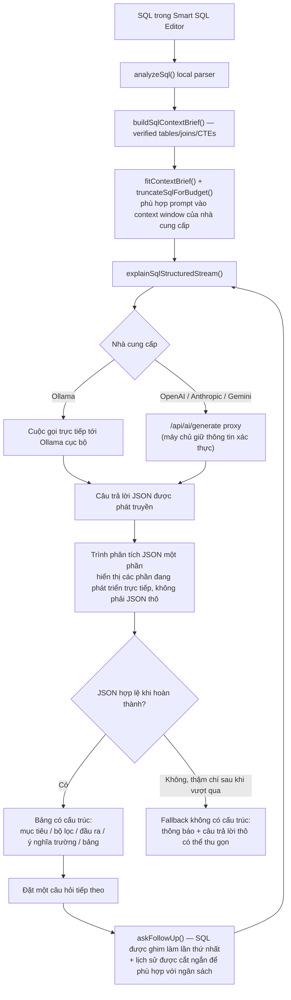
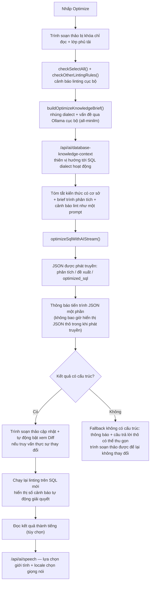
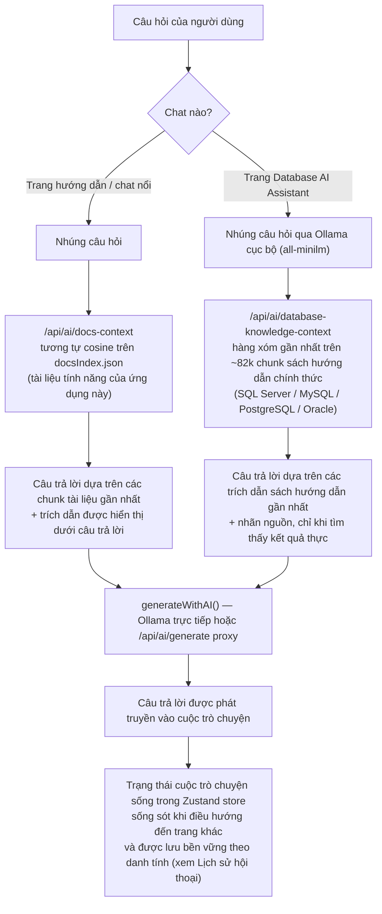
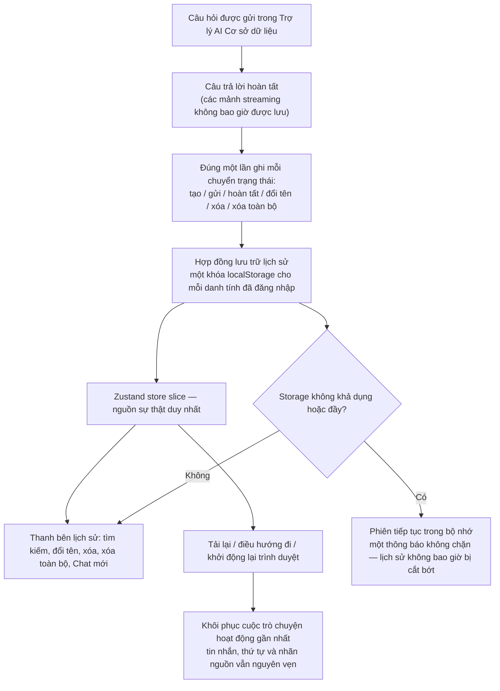
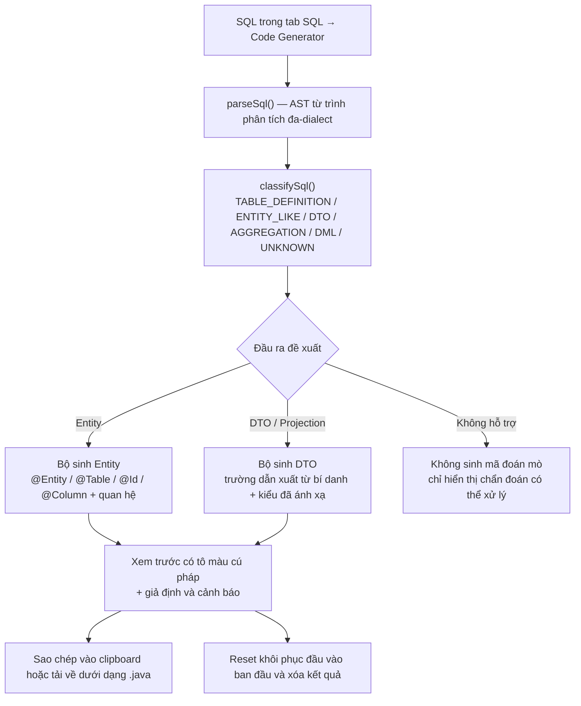
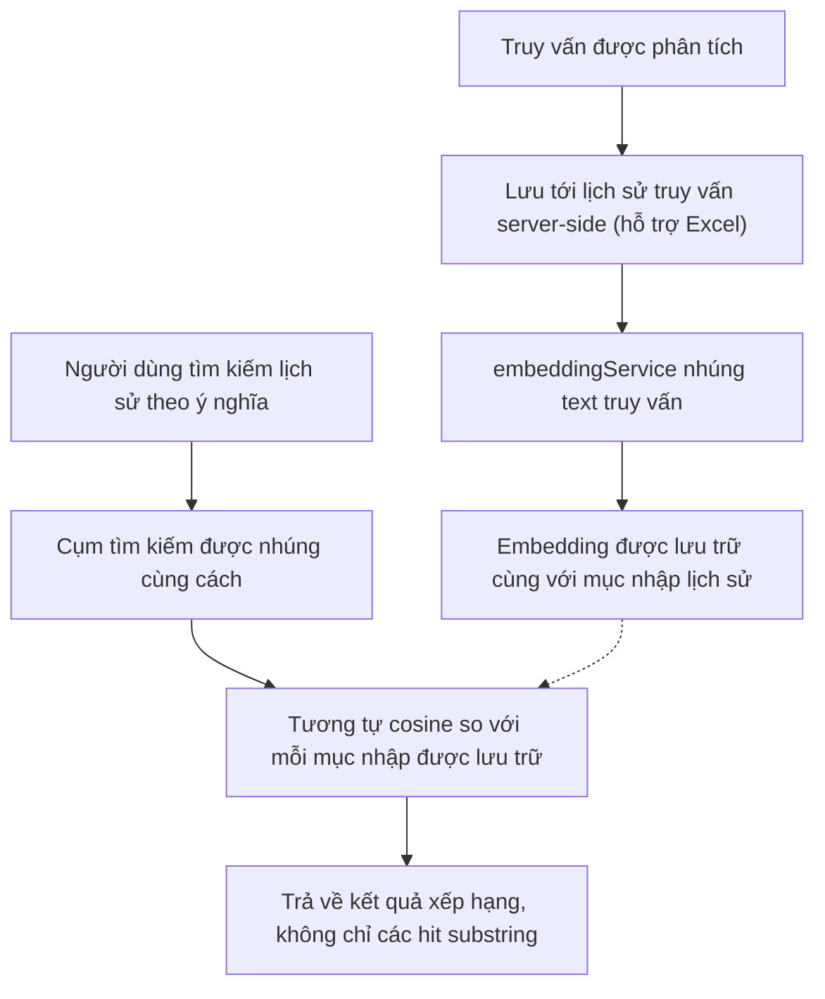
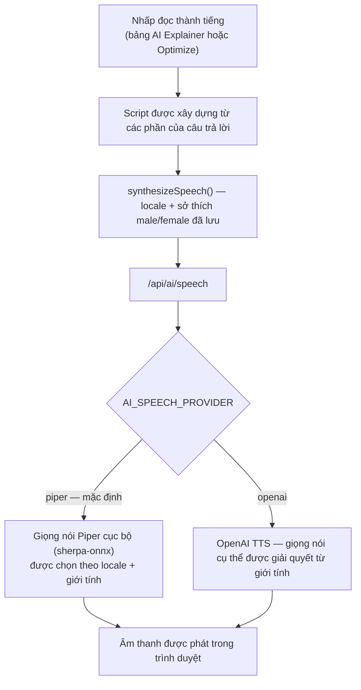

# SQL Visualizer

**📚 Ngôn ngữ:** English | [Tiếng Việt]

Công cụ phân tích và trực quan hóa SQL toàn diện, xây dựng bằng Next.js 15, React 19 và TypeScript. Phân tích độ phức tạp truy vấn, trực quan hóa quan hệ giữa các bảng, khám phá CTE và phân tích chi tiết điều kiện JOIN trên nhiều SQL dialects.

## 🚀 Các tính năng chính

### Công cụ phân tích cốt lõi

- **Nhập truy vấn** - Dán SQL hoặc import MyBatis XML với hỗ trợ đa-dialect (MySQL, PostgreSQL, SQL Server, Oracle)
- **Trình trực quan hóa quan hệ bảng (Relationship Graph Visualizer)** - Trực quan hóa tương tác các quan hệ giữa bảng và kết nối JOIN với các cạnh được mã hóa màu và các tùy chọn layout đa dạng
- **Phân tích JOIN** - Phân tích sâu các điều kiện JOIN với phân tích độ phức tạp, phát hiện cột/toán tử và hỗ trợ đa-dialect
- **Bảng chỉ số (Metrics Dashboard)** - Xếp độ phức tạp thời gian thực (0-100) với các phân tích chi tiết về từ khóa, trường SELECT, JOIN, CTE, subquery và window functions. Mỗi thẻ metric và mục subquery hiển thị số dòng nguồn và có thể nhảy trực tiếp đến dòng đó trong Smart SQL Editor
- **Phân tích CTE** - Khám phá Common Table Expressions và nguồn gốc trường với cấu trúc cây trực quan, bao gồm phát hiện subquery lồng nhau per-CTE với độ sâu chính xác
- **Smart SQL Editor** - Trình soạn thảo truy vấn dựa trên Monaco với hỗ trợ đa-dialect, định dạng, xem so sánh trước/sau và phân tích thời gian thực

### Sinh mã (Code Generation)

- **SQL → Trình sinh mã (Code Generator)** - Chuyển SQL thành mã tầng ứng dụng. Một câu `CREATE TABLE` trở thành entity Java/JPA (với `@Entity`, `@Table`, `@Id`, `@Column` và các quan hệ được suy luận) và một câu `SELECT` trở thành lớp DTO/projection, dựa trên phân loại SQL tự động, ánh xạ kiểu dữ liệu SQL sang ngôn ngữ đích và chiến lược đặt tên có thể cấu hình. Mã sinh ra hiển thị trong khung xem trước có tô màu cú pháp để sao chép hoặc tải về, và mọi giả định hay cấu trúc chưa hỗ trợ đều được báo dưới dạng cảnh báo thay vì đoán mò

### Các tính năng hỗ trợ bởi AI

- **AI SQL Explainer** - Chuyển truy vấn thành giải thích rõ ràng bằng ngôn ngữ tự nhiên (mục tiêu, bộ lọc, đầu ra, bảng được tham chiếu)
- **AI Optimize** - Truyền phát các đề xuất tối ưu hóa và truy vấn được viết lại, dựa trên các sự kiện được xác minh của trình phân tích cục bộ (bảng, join, CTE graph)
- **Docs Consultant Chat** - Chat kiểu RAG trên tài liệu tính năng của chính ứng dụng (nhúng câu hỏi, lấy các chunk tài liệu gần nhất, trả lời có trích dẫn)
- **Database AI Assistant** - Chat cơ sở dữ liệu chung cho SQL, thiết kế schema, indexes, transactions và hiệu năng. Khi chỉ mục RAG cục bộ có sẵn, các câu trả lời dựa trên các trích dẫn liên quan từ các sách hướng dẫn chính thức SQL Server, MySQL, PostgreSQL và Oracle, với nhãn nguồn được hiển thị dưới câu trả lời
- **Lịch sử hội thoại Database AI Assistant** - Lịch sử nhiều cuộc trò chuyện, bền vững, cho Trợ lý AI Cơ sở dữ liệu. Cuộc trò chuyện vẫn còn sau khi tải lại trang, điều hướng đi nơi khác và khởi động lại trình duyệt, được đặt tiêu đề tự động từ câu hỏi đầu tiên, nhóm theo tính gần đây, và có thể tìm kiếm, đổi tên, xóa hoặc xóa toàn bộ. Lịch sử được lưu trên thiết bị và phân chia theo danh tính đã đăng nhập; khách không có lịch sử lưu sẵn theo thiết kế
- **Lịch sử truy vấn với Tìm kiếm theo ngữ nghĩa** - Mỗi truy vấn được phân tích được lưu (kho lưu trữ Excel server-side) và có thể tìm kiếm theo ý nghĩa chứ không chỉ substring thông qua embeddings
- **Hỗ trợ nhiều nhà cung cấp** - Ollama cục bộ (không cần khóa API) hoặc các nhà cung cấp cloud (OpenAI, Anthropic, Gemini) được xác nhận thông qua máy chủ ứng dụng để thông tin xác thực không bao giờ tiếp cận trình duyệt
- **Text-to-Speech** - Đọc thành tiếng các giải thích/ghi chú tối ưu hóa AI (tổng hợp giọng nói của trình duyệt, với các giọng nói Piper cục bộ tùy chọn)

### Xác thực

- **Đăng nhập / Đăng ký** - Cổng thông tin xác thực Demo (`admin` / `1234@`) cộng với các nút đăng nhập Google/Microsoft trên trang đích trước khi không gian truy vấn có thể truy cập. Hướng dẫn cấu hình: [Tùy chọn: Đăng nhập Google và Microsoft](#tùy-chọn-đăng-nhập-google-và-microsoft)
- **Truy cập Guest (đang phát triển)** - Một đường dẫn "tiếp tục mà không cần tài khoản" cho phép khách truy cập dưới dạng người dùng ẩn danh để đánh giá. Khách nhận được mọi khả năng không phải AI: phân tích cú pháp SQL và định dạng, biểu đồ quan hệ, xếp độ phức tạp, bảng chỉ số, phân tích CTE và tất cả xuất. **Các tính năng hỗ trợ AI được dành riêng cho người dùng đã đăng nhập** — bao gồm những tính năng chạy theo mô hình được cấu hình cục bộ. Spec: [`specs/013-guest-access-mode/`](./specs/013-guest-access-mode/). **Chưa được phát hành** — xem lưu ý trạng thái dưới đây.

> **Trạng thái truy cập Guest:** đang phát triển (1 trong 74 hành vi được theo dõi được thực hiện). Việc thực thi server-side bảo vệ công suất AI được chia sẻ không có sẵn, vì vậy các tuyến đường AI hiện đó chấp nhận những người gọi không được xác thực. Không tiếp xúc một triển khai công khai cho đến khi điều đó kết thúc.

### Công nghệ sử dụng

- **Next.js 15** - Phiên bản mới nhất với hiệu năng được cải thiện và App Router
- **React 19** - React mới nhất với các khả năng được nâng cao
- **TypeScript** - Kiểm tra kiểu nghiêm ngặt để đảm bảo độ tin cậy của code
- **Tailwind CSS** - Framework CSS utility-first với các biến chủ đề tùy chỉnh
- **Zustand** - Quản lý trạng thái nhẹ cho trạng thái ứng dụng toàn cục
- **Lucide React** - Thư viện biểu tượng cho các phần tử UI nhất quán
- **Monaco Editor** (`@monaco-editor/react`) - Trình soạn thảo mã, xem diff và minimap của Smart SQL Editor
- **ReactFlow** - Canvas node/edge tương tác cung cấp năng lượng cho Trình trực quan hóa quan hệ bảng
- **dt-sql-parser** - Phân tích cú pháp SQL dựa trên AST được sử dụng để kiểm tra chéo trình phân tích dựa trên regex để xác thực dialect
- **Vitest** - Trình chạy kiểm thử đơn vị (`npm run test`)

## 🔀 Sơ đồ luồng tính năng AI

Cách mỗi tính năng hỗ trợ AI thực sự di chuyển dữ liệu thông qua ứng dụng — từ trình phân tích cục bộ SQL thông qua xây dựng prompt, grounding truy xuất và nhà cung cấp hoạt động (Ollama cục bộ hoặc API cloud được xác nhận máy chủ).

### AI SQL Explainer & Follow-up Chat



### AI Optimize (Smart SQL Editor)



### Docs Consultant Chat & Database AI Assistant (RAG)



### Lịch sử hội thoại Database AI Assistant



### SQL → Trình sinh mã (Code Generator)



### Tìm kiếm theo ngữ nghĩa trong lịch sử truy vấn



### Text-to-Speech (Đọc thành tiếng)



## 🛠️ Cài đặt

1. Cài đặt dependencies:

```bash
npm install
# hoặc
yarn install
```

2. Khởi động development server:

```bash
npm run dev
# hoặc
yarn dev
```

3. Mở [http://localhost:4028](http://localhost:4028) trong trình duyệt để xem kết quả.

### Cấu hình Ollama Models và Hiệu năng

SQL Visualizer sử dụng Ollama cục bộ tại `http://localhost:11434` theo mặc định. Ứng dụng hiện sử dụng các mô hình này:

| Mục đích | Mô hình | Được sử dụng bởi |
| --- | --- | --- |
| Chat, giải thích SQL, tối ưu hóa SQL, và Database AI Assistant answers | `qwen2.5-coder:3b` | Mô hình Ollama chat mặc định, có thể cấu hình trong **Settings > AI Model Configuration** |
| Truy xuất RAG sách hướng dẫn cơ sở dữ liệu | `all-minilm` | Bắt buộc cho grounding Database AI Assistant; phải khớp với không gian nhúng chỉ mục cục bộ |
| Tìm kiếm ngữ nghĩa lịch sử truy vấn | `nomic-embed-text` | Tìm SQL được phân tích trước đó với ý nghĩa tương tự |

Cài đặt hoàn chỉnh:

```bash
ollama pull qwen2.5-coder:3b
ollama pull all-minilm
ollama pull nomic-embed-text
```

Đối với quy trình công việc phát triển đơn người dùng phản ứng nhanh, sử dụng các cài đặt này trong **Settings > AI Model Configuration**:

| Cài đặt | Giá trị được khuyến nghị | Tại sao |
| --- | --- | --- |
| Nhà cung cấp (Provider) | `Ollama` | Giữ SQL prompts và RAG embeddings trên máy cục bộ |
| Base URL | `http://localhost:11434` | Địa chỉ dịch vụ Ollama cục bộ mặc định |
| Chat model | `qwen2.5-coder:3b` | Cân bằng chất lượng SQL, tốc độ streaming và mức sử dụng bộ nhớ |
| Nhiệt độ (Temperature) | `0.1` | Tạo ra các giải thích SQL và đề xuất tối ưu hóa xác định hơn |
| Cửa sổ ngữ cảnh (Context window) | `8192` | Hỗ trợ truy vấn SQL, ngữ cảnh trình phân tích, lịch sử cuộc trò chuyện và trích dẫn sách hướng dẫn được truy xuất |
| Token đầu ra tối đa (Maximum output tokens) | `1200` | Giữ các câu trả lời được phát truyền ngắn gọn và giảm độ trễ tạo |
| Batch explain concurrency | `1` trên CPU, `2` trên GPU có khả năng | Ngăn chặn nhiều công việc inference cục bộ cạnh tranh cho cùng RAM/VRAM |

Cửa sổ ngữ cảnh được cấu hình phải khớp với máy chủ Ollama. Trước khi đặt ngữ cảnh ứng dụng thành `8192`, hãy chạy Ollama với cùng giới hạn (hoặc cấu hình giá trị `num_ctx` tương đương trong Modelfile):

```bash
# PowerShell, cho phiên terminal hiện tại
$env:OLLAMA_CONTEXT_LENGTH = "8192"
ollama serve
```

Để có thông lượng tốt nhất, hãy giữ các mô hình ấm khi ứng dụng đang hoạt động, tránh chạy nhiều mô hình chat lớn cùng lúc và sử dụng GPU acceleration khi có sẵn. `qwen2.5-coder:3b` cần khoảng 5 GB lưu trữ mô hình và thường được hưởng lợi từ ít nhất 8 GB RAM/VRAM có sẵn; giảm cửa sổ ngữ cảnh quay lại `4096` trên các máy bị hạn chế bộ nhớ. Không thay đổi mô hình RAG từ `all-minilm` trừ khi bạn xây dựng lại chỉ mục Database Knowledge với mô hình thay thế.

### Tùy chọn: Xây dựng chỉ mục Database Knowledge RAG

Database AI Assistant hoạt động mà không cần chỉ mục kiến thức cục bộ, sử dụng kiến thức chung của mô hình chat được cấu hình. Để grounding câu trả lời trong các trích dẫn sách hướng dẫn cơ sở dữ liệu chính thức được bao gồm và hiển thị nguồn:

```bash
ollama pull all-minilm
npm run build:database-knowledge-index
```

Lệnh này yêu cầu Ollama chạy và dump nguồn `src/lib/ai/document_chunks.json` cục bộ có sẵn. Nó nhúng lại khoảng 82,000 trích dẫn sách hướng dẫn với `all-minilm`, sau đó ghi một chỉ mục nhị phân cục bộ dưới `src/lib/ai/data/`. Chỉ mục được cố ý bỏ qua git và mất khoảng 20-30 phút để xây dựng; chỉ chạy lại khi dump nguồn hoặc mô hình nhúng thay đổi.

### Tùy chọn: Đăng nhập Google và Microsoft

Trang đăng nhập có thể xác thực người dùng bằng tài khoản Google hoặc Microsoft thật. Luồng chạy hoàn
toàn trong trình duyệt theo OAuth 2.0 implicit flow (`response_type=token`): nút bấm mở màn hình đồng ý
của nhà cung cấp trong một popup, `/oauth/callback` chuyển kết quả trở lại trang đăng nhập, và máy chủ
xác minh access token nhận được rồi mới cấp session cookie. Chỉ cần client ID công khai — không cần
OAuth client phía máy chủ và không cần client secret.

Thêm các client ID bạn muốn bật vào `.env.local`:

```env
NEXT_PUBLIC_GOOGLE_CLIENT_ID=your-google-client-id.apps.googleusercontent.com
NEXT_PUBLIC_MICROSOFT_CLIENT_ID=your-azure-app-client-id
```

Nhà cung cấp nào chưa có biến tương ứng vẫn hiển thị thông báo giải thích thay vì mở popup
(`Đăng nhập Google chưa được cấu hình. Hãy đặt NEXT_PUBLIC_GOOGLE_CLIENT_ID và khởi động lại ứng dụng.`).

| Nhà cung cấp | Endpoint ủy quyền | Scope | Redirect URI cần đăng ký |
| --- | --- | --- | --- |
| Google | `https://accounts.google.com/o/oauth2/v2/auth` | `openid profile email` | `<origin>/oauth/callback` |
| Microsoft | `https://login.microsoftonline.com/common/oauth2/v2.0/authorize` | `openid profile email User.Read` | `<origin>/oauth/callback` |

`<origin>` là scheme, host và cổng đang phục vụ ứng dụng — `http://localhost:4028` với `npm run dev`.
Ứng dụng gọi `<origin>/oauth/callback?provider=google` (hoặc `microsoft`); hãy đăng ký đường dẫn
`<origin>/oauth/callback` — nếu nhà cung cấp báo sai redirect URI, hãy đăng ký URI đầy đủ kèm query.

**Google Cloud Console**

1. Mở [Credentials](https://console.cloud.google.com/apis/credentials) và chọn
   **Create credentials → OAuth client ID**. Nếu được yêu cầu, hãy tạo trước OAuth consent screen; khi
   consent screen còn ở trạng thái *Testing*, chỉ những người dùng được thêm vào danh sách test users
   mới đăng nhập được.
2. Chọn loại ứng dụng **Web application**.
3. Thêm `http://localhost:4028` vào **Authorized JavaScript origins**.
4. Thêm `http://localhost:4028/oauth/callback` vào **Authorized redirect URIs**.
5. Copy **Client ID** (kết thúc bằng `.apps.googleusercontent.com`) vào `NEXT_PUBLIC_GOOGLE_CLIENT_ID`.

**Microsoft Entra ID (Azure portal)**

1. Mở **Microsoft Entra ID → App registrations → New registration** trong
   [Azure portal](https://portal.azure.com).
2. Đặt **Supported account types** thành *Accounts in any organizational directory and personal Microsoft
   accounts* — khớp với authority `/common` mà ứng dụng gọi.
3. Trong **Redirect URI**, chọn nền tảng **Single-page application (SPA)** và nhập
   `http://localhost:4028/oauth/callback`.
4. Trong **API permissions**, thêm quyền Microsoft Graph delegated **User.Read** (ứng dụng đọc
   `https://graph.microsoft.com/v1.0/me` để lấy hồ sơ) và cấp admin consent nếu tenant của bạn yêu cầu.
5. Bỏ qua **Certificates & secrets** — luồng này không dùng client secret. Copy **Application (client) ID**
   vào `NEXT_PUBLIC_MICROSOFT_CLIENT_ID`.

**Hoàn tất và kiểm tra**

1. Khởi động lại dev server sau khi sửa `.env.local`: giá trị `NEXT_PUBLIC_*` được nhúng lúc Next.js khởi
   động, nếu không các nút vẫn đọc giá trị cũ.
2. Đăng xuất, bấm **Google** hoặc **Microsoft** và đồng ý màn hình consent trong popup. Phải cho phép
   popup cho origin của ứng dụng (nếu không, nút sẽ báo `Allow Popups to continue signing in.`).
3. Kết quả mong đợi: toast `Đã đăng nhập bằng Google với tài khoản <name>.` và chuyển hướng tới
   `/query-input`. Hủy màn hình consent sẽ hiện `Đã hủy hoặc bị nhà cung cấp từ chối xác thực.`
4. Với phiên bản triển khai thật, đăng ký origin thực tế làm mục bổ sung ở cả hai console, ví dụ
   `https://your-domain/oauth/callback`.

## 📁 Cấu trúc dự án

```
sql-visualizer/
├── docs/
│   ├── spring-backend-calcite/     # Tài liệu thiết kế backend cho dịch vụ phân tích Spring/Calcite trong tương lai
│   └── ui-prompts/                 # Thông số kỹ thuật prompt UI/UX (trang chủ, trình giải thích, dashboards)
├── models/
│   └── piper/                     # Giọng nói Piper TTS cục bộ (được tải xuống qua `npm run setup:piper`)
├── public/
│   └── assets/
│       ├── images/                 # Hình ảnh tĩnh
│       └── markdown/               # Tài liệu tính năng, được lập chỉ mục cho chat Docs Consultant
│           ├── FEATURES.md
│           ├── FEATURES_INDEX.md
│           └── features/           # Hướng dẫn mô-đun per-feature
│               ├── core-analysis-tools/
│               ├── database-ai-assistant/ # Database AI Assistant và hướng dẫn cài đặt RAG
│               ├── smart-editor-ai-assistant/
│               └── voice-and-docs-support/
├── scripts/
│   ├── setup-piper.mjs             # Tải xuống/cấu hình giọng nói Piper TTS cục bộ
│   ├── build-docs-index.mjs        # Xây dựng lại src/lib/ai/docsIndex.json cho Docs Consultant
│   └── build-database-knowledge-index.mjs # Nhúng lại sách hướng dẫn chính thức cho Database AI Assistant RAG index
├── src/
│   ├── app/
│   │   ├── layout.tsx              # Layout gốc với theme provider
│   │   ├── page.tsx                # Trang đích công khai (hero, tính năng, quy trình làm việc, link README)
│   │   ├── api/ai/                 # Tuyến đường máy chủ xác nhận AI generate/embed/speech/retrieval
│   │   │   ├── database-knowledge-context/ # Truy xuất RAG trên sách hướng dẫn cơ sở dữ liệu chính thức
│   │   │   └── docs-context/        # Truy xuất RAG trên tài liệu tính năng SQL Visualizer
│   │   ├── database-ai-assistant/  # Chat Q&A cơ sở dữ liệu chung với trích dẫn RAG + lịch sử hội thoại bền vững
│   │   ├── query-input/            # Nhập SQL, tham số + tab SQL → Trình sinh mã (Code Generator)
│   │   ├── relationship-graph-visualizer/  # Trực quan hóa biểu đồ và phân tích JOIN
│   │   ├── cte-analysis/           # Khám phá và phân tích CTE
│   │   ├── sql-metrics-dashboard/  # Metrics độ phức tạp, xếp điểm và xem chi tiết dòng-jump
│   │   ├── smart-sql-editor/       # Trình soạn thảo dựa trên Monaco, bảng giải thích/tối ưu hóa AI
│   │   ├── guideline/              # Tài liệu tính năng + chat Docs Consultant AI
│   │   ├── readme/                 # Trình xem README công khai (hiển thị project README.md)
│   │   └── settings-preferences/   # Tùy chỉnh người dùng, chủ đề và cấu hình nhà cung cấp AI
│   ├── components/
│   │   ├── AppLayout.tsx          # Thành phần layout chính
│   │   └── ...
│   ├── lib/
│   │   ├── ai/
│   │   │   └── databaseAssistant/            # Chat History: storage contract + helpers
│   │   │       ├── chatHistoryStorage.ts        # Storage contract cho Chat History
│   │   │       ├── chatHistoryLocalStorage.ts   # localStorage implementation
│   │   │       ├── chatHistoryIdentity.ts       # Identity resolution cho partitioning
│   │   │       └── chatHistoryHelpers.ts        # Utility functions cho presentation
│   │   ├── codegen/                          # SQL → Code Generator (parser, classifier, type mapping, renderers)
│   │   ├── conversationHistoryStore.ts       # Slice trạng thái lịch sử hội thoại (lưu theo danh tính)
│   │   └── ...
│   ├── locales/
│   │   ├── en.ts                  # Chuỗi tiếng Anh
│   │   └── vi.ts                  # Chuỗi tiếng Việt
│   └── types/
│       └── ...
├── tests/
│   ├── unit/
│   │   ├── dbAssistantChatHistoryStorage.test.ts    # 26/26 tests PASSING ✅
│   │   └── dbAssistantChatHistoryHelpers.test.ts    # 29/29 tests PASSING ✅
│   └── ...
├── specs/
│   ├── 001-sql-visualizer-baseline/
│   ├── 014-db-assistant-chat-history/  # Feature 014: Chat History
│   ├── 015-sql-code-generator/        # Feature 015: SQL → Code Generator
│   └── ...
└── package.json
```

## 📖 Tài liệu

- **[Confluence EN](docs/confluence/SQL_Visualizer_Confluence_EN.md)** - Tài liệu Confluence (Tiếng Anh)
- **[Confluence VI](docs/confluence/SQL_Visualizer_Confluence_VI.md)** - Tài liệu Confluence (Tiếng Việt)

## 🤝 Đóng góp

Cảm ơn bạn đã quan tâm đến việc đóng góp! Khi gửi thay đổi, vui lòng bảo đảm:

- Mọi tính năng đều có bản dịch tiếng Anh và tiếng Việt
- Component được khai báo kiểu đầy đủ bằng TypeScript
- Mã nguồn tuân theo phong cách mã hiện có của dự án
- Tính năng phức tạp được kèm tài liệu trong FEATURES.md

## ⚖️ Giấy phép

Vui lòng xem file LICENSE trong dự án này.

## 📧 Liên hệ

Có câu hỏi hoặc đề xuất? Vui lòng tạo một issue hoặc liên hệ với đội phát triển.

---

**Cảm ơn bạn đã sử dụng SQL Visualizer!** 🚀
