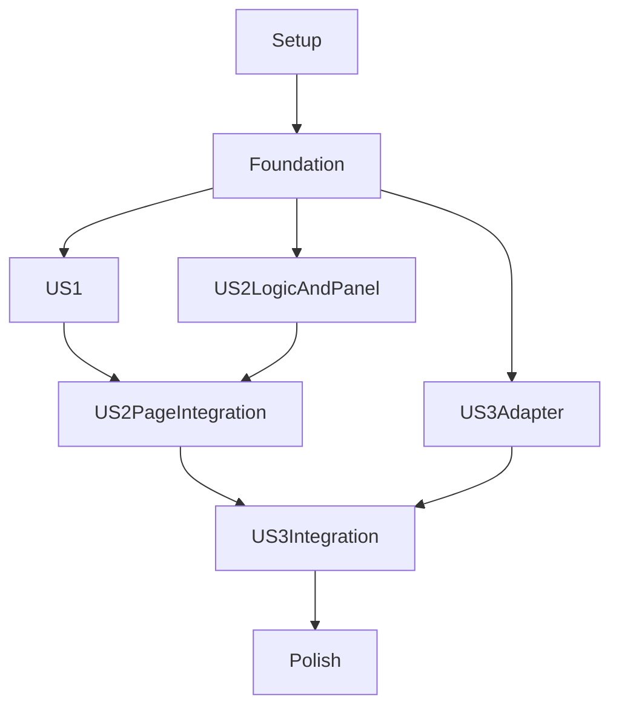

# Tasks: SQL Before/After Comparison

**Input**: Design documents from `specs/017-sql-before-after-comparison/`

**Prerequisites**: `plan.md`, `spec.md`, `research.md`, `data-model.md`, and `contracts/comparison-panel.md`

**Tests**: Focused tests are included because the project constitution requires tests for parser logic, visualization components, and AI integrations.

**Organization**: Tasks are grouped by the three P1 user stories in `spec.md`. All new behavior remains analysis-only.

## Phase 1: Setup

**Purpose**: Confirm the existing project setup is sufficient; no dependency or application scaffolding changes are planned.

- [X] T001 Confirm the existing Vitest, Testing Library, Monaco, and `type-check` setup; do not add dependencies in `package.json`

---

## Phase 2: Foundational

**Purpose**: Define shared result contracts and localization keys required by every user story.

- [X] T002 Define shared comparison snapshot, evidence, finding, assessment, and lifecycle types in `src/lib/sql/sqlComparison.ts`
- [X] T003 [P] Add English comparison labels, actions, statuses, limitations, and accessibility strings in `src/locales/en.ts`
- [X] T004 [P] Add Vietnamese translations matching the comparison keys in `src/locales/vi.ts`

**Checkpoint**: Shared types and localized UI vocabulary are available before story implementation.

---

## Phase 3: User Story 1 - Compare an edited query with an explicit baseline (Priority: P1)

**Goal**: Capture an explicit, immutable Before query for the browser-tab session and compare it with an immutable snapshot of current editor SQL and dialect. Editing, navigation, refresh, and stale-run behavior must never overwrite editor content or show obsolete results as current.

**Independent Test**: Capture and refresh a baseline, edit SQL, start comparison, and verify the captured Before/After/dialect values; verify same-tab reload retention, storage failure handling, and stale results after an input changes.

### Tests for User Story 1

- [X] T005 [P] [US1] Add baseline schema, capture, refresh, rehydration, invalid-data, and storage-failure tests in `tests/unit/sqlComparisonStorage.test.ts`
- [X] T006 [P] [US1] Add query-input tests for no-baseline, explicit capture, reload rehydration, snapshot capture, stale inputs, and editor preservation in `tests/unit/query-input-sql-comparison.test.tsx`

### Implementation for User Story 1

- [X] T007 [US1] Implement validated tab-scoped baseline read, capture, refresh, and failure handling in `src/lib/sql/sqlComparisonStorage.ts`
- [X] T008 [US1] Integrate baseline controls, same-tab rehydration, immutable run snapshots, supersession, and stale-result checks into `src/app/query-input/page.tsx`

**Checkpoint**: Baseline lifecycle and run snapshot behavior pass independently without requiring structural findings or AI.

---

## Phase 4: User Story 2 - Understand structural changes and evidence (Priority: P1)

**Goal**: Show an exact Before/After diff and supported structural changes with source evidence in an automatically opened, accessible, toggleable panel that preserves current results when closed.

**Independent Test**: Compare representative projection, source, join, filter, grouping, ordering, pagination, and write-scope changes; verify evidence and partial status for unsupported analysis, formatting-only distinction, identical SQL behavior, panel toggling, and no rerun on reopen.

### Tests for User Story 2

- [X] T009 [P] [US2] Add structural comparison tests for supported changes, evidence, formatting-only changes, identical SQL, and partial analysis in `tests/unit/sqlComparison.test.ts`
- [X] T010 [P] [US2] Add panel tests for diff rendering, findings, open/close/reopen behavior, keyboard access, and stale state in `tests/unit/sqlComparisonPanel.test.tsx`
- [X] T011 [P] [US2] Extend launcher tests to verify fourth-panel ordering, accessible state, and focus behavior in `tests/unit/side-panel-tab.test.tsx`

### Implementation for User Story 2

- [X] T012 [US2] Implement deterministic structural comparison, evidence mapping, formatting-only detection, no-change status, and honest partial results in `src/lib/sql/sqlComparison.ts`
- [X] T013 [US2] Extend the shared side-panel rail rank and accessible launcher behavior for the comparison panel in `src/app/smart-sql-editor/components/SidePanelTab.tsx`
- [X] T014 [US2] Implement the comparison drawer with Monaco Before/After diff, deterministic findings, assessments, partial and stale states in `src/app/smart-sql-editor/components/SqlComparisonPanel.tsx`
- [X] T015 [US2] Wire comparison results to automatic panel opening and visibility-only close/reopen behavior in `src/app/query-input/page.tsx`

**Checkpoint**: Deterministic comparison and panel interactions work with AI disabled and do not execute or modify SQL.

---

## Phase 5: User Story 3 - Review potential risks and verification needs (Priority: P1)

**Goal**: Present deterministic findings separately from optional AI interpretation, communicate independent equivalence/safety/performance/verification statuses, and retain deterministic results through AI failure.

**Independent Test**: Compare a query with a removed filter using mocked analysis and AI. Verify evidence-backed deterministic findings, clearly labeled AI hypotheses, separate inconclusive/not-verified statuses, actionable verification guidance, skipped AI for identical SQL, and deterministic-result retention on unavailable, malformed, failed, cancelled, or stale AI responses.

### Tests for User Story 3

- [X] T016 [P] [US3] Add mocked AI tests for prompt grounding, untrusted SQL instructions, response validation, malformed output, failure, and cancellation in `tests/unit/sqlComparisonAi.test.ts`
- [X] T017 [US3] Extend panel tests for deterministic-versus-AI labeling, assessment dimensions, AI loading/failure states, and verification recommendations in `tests/unit/sqlComparisonPanel.test.tsx`

### Implementation for User Story 3

- [X] T018 [US3] Implement the bounded grounded prompt, streaming provider request, and runtime validation for AI explanations in `src/lib/ai/sqlComparisonAi.ts`
- [X] T019 [US3] Integrate explicit AI explanation requests, streamed progress, identical-SQL skip, cancellation, stale-run guards, and failure isolation in `src/app/query-input/page.tsx`
- [X] T020 [US3] Render streamed AI interpretations separately from deterministic results and expose independent assessment and verification states in `src/app/smart-sql-editor/components/SqlComparisonPanel.tsx`

**Checkpoint**: AI remains optional and advisory; failed or stale AI output cannot erase or override deterministic results.

---

## Phase 6: Polish & Cross-Cutting Concerns

**Purpose**: Verify localization, accessibility, type safety, security boundaries, and the complete acceptance walkthrough.

- [X] T021 [P] Verify every comparison key has equivalent English and Vietnamese content in `src/locales/en.ts` and `src/locales/vi.ts`
- [X] T022 Review the comparison workflow against the analysis-only, privacy, and uncertainty requirements in `specs/017-sql-before-after-comparison/spec.md`
- [X] T023 Run focused comparison tests, `npm run type-check`, and `npm test` using the commands documented in `specs/017-sql-before-after-comparison/quickstart.md`
- [ ] T024 Complete the manual baseline, panel, stale-state, parser-limitation, AI-failure, localization, and no-SQL-execution walkthrough in `specs/017-sql-before-after-comparison/quickstart.md`

---

## Dependencies & Execution Order

### Phase Dependencies

- **Setup (Phase 1)**: No code prerequisites; confirms existing dependencies and scripts.
- **Foundational (Phase 2)**: Completes shared types and localization before story work.
- **User Stories (Phases 3-5)**: Begin after Phase 2. US2 uses the snapshot/lifecycle integration from US1 for its page workflow. US3 builds on the deterministic result contract and panel from US2.
- **Polish (Phase 6)**: Depends on all three user stories being implemented.

### User Story Dependencies

- **US1 (P1)**: Starts after Phase 2; independent baseline and immutable-run lifecycle increment.
- **US2 (P1)**: Structural comparison and panel can be developed independently at the logic/component level after Phase 2; final page integration depends on the US1 run lifecycle.
- **US3 (P1)**: AI adapter tests and implementation can proceed after Phase 2; panel/page integration depends on US2 deterministic results and panel.



### Parallel Opportunities

- Phase 2 locale tasks T003 and T004 can run in parallel after the shared key set is established in T002.
- US1 tests T005 and T006 can be authored in parallel; storage implementation T007 must precede page integration T008.
- US2 tests T009, T010, and T011 can be authored in parallel. Structural logic T012 and rail extension T013 affect separate files; panel implementation T014 follows the shared types and rail API.
- US3 AI adapter tests T016 can run independently from US3 panel test additions T017 after US2 panel contracts exist. AI adapter T018 and panel rendering T020 affect separate files; page integration T019 needs T018 and the US1/US2 page state.
- Cross-story parallel implementation is limited: US1 and isolated US2 logic/UI work can overlap, but page integration must be coordinated because `src/app/query-input/page.tsx` is shared.

## Parallel Example: User Story 2

```text
Task: T009 Add structural comparison tests in tests/unit/sqlComparison.test.ts
Task: T010 Add panel tests in tests/unit/sqlComparisonPanel.test.tsx
Task: T011 Extend rail tests in tests/unit/side-panel-tab.test.tsx
```

## Implementation Strategy

### MVP First (User Stories 1 and 2)

1. Complete setup and foundational tasks.
2. Complete US1 and US2: baseline lifecycle, captured snapshots, deterministic structural evidence, and toggleable diff panel.
3. Validate the integrated comparison independently with AI disabled; this is the smallest useful user-facing MVP.
4. Add US3 AI explanation and risk/verification presentation after deterministic results are stable.

### Incremental Delivery

1. Deliver explicit capture and immutable snapshots (US1).
2. Deliver diff, deterministic findings, and persistent toggleable panel (US2).
3. Deliver optional grounded AI explanations and separate assessments (US3).
4. Complete the full automated and manual validation in Phase 6.

## Format Validation

Every executable task uses the required unchecked-checkbox format, sequential task ID, optional `[P]` only for parallel work, `[US1]`/`[US2]`/`[US3]` on user-story tasks, and an exact repository path in its description.